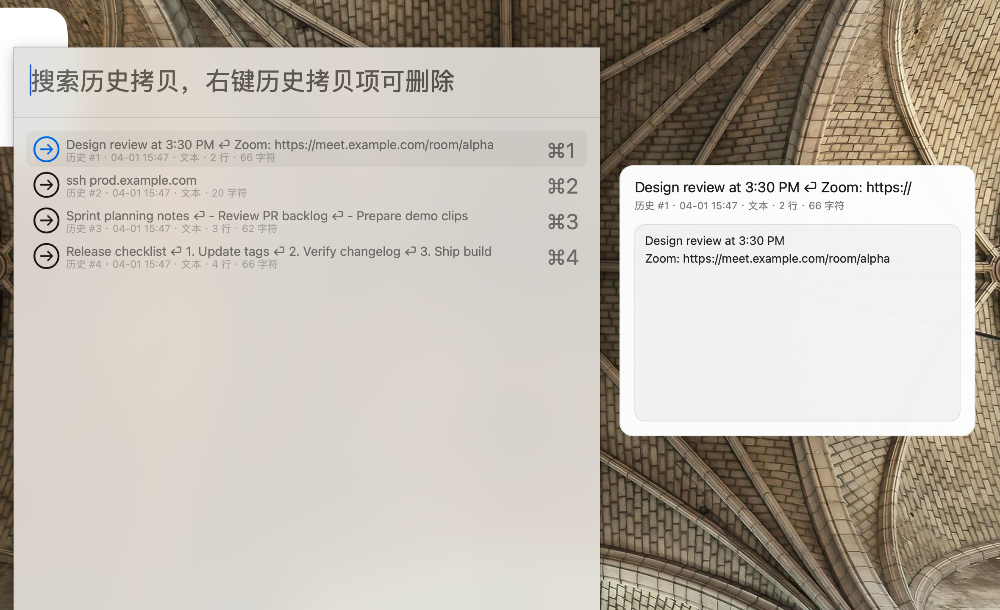
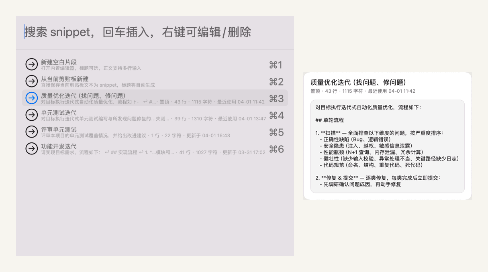
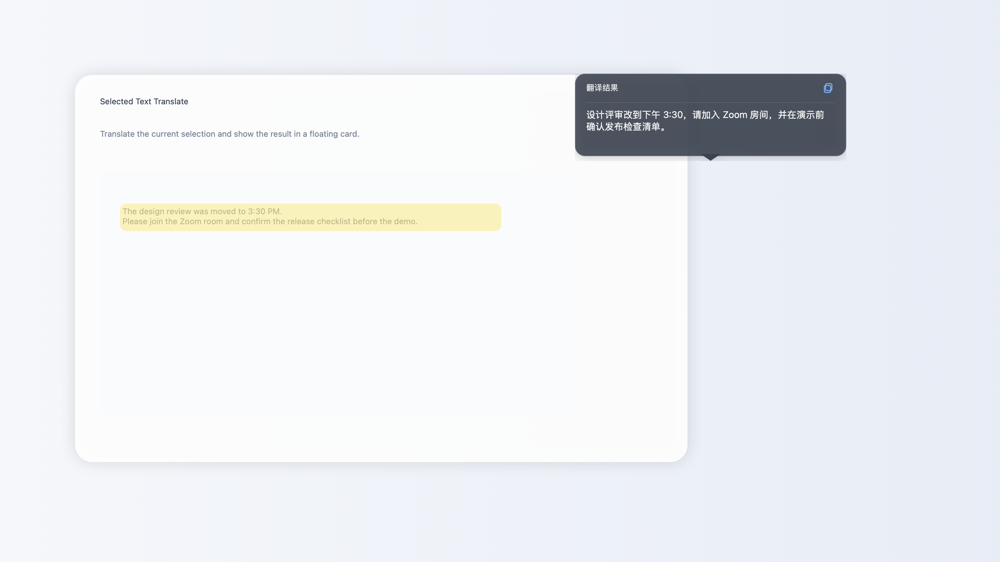
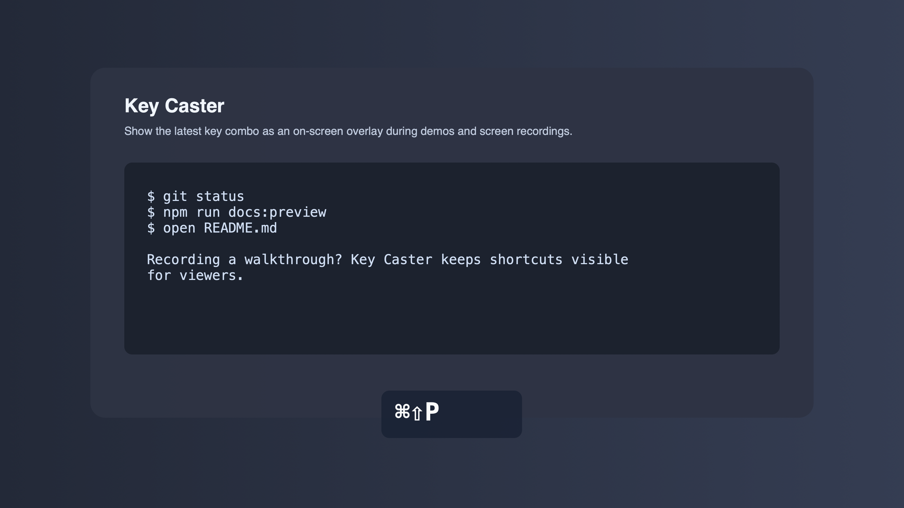
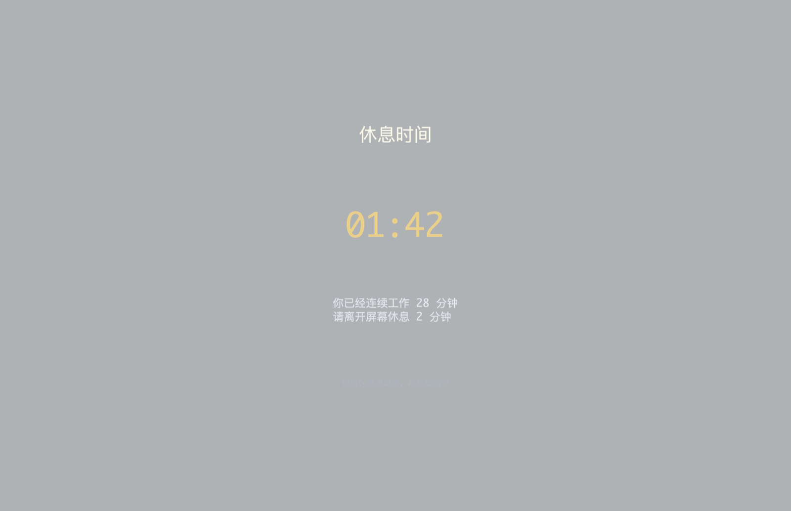

# dot-hammerspoon

[English](README.md) | [简体中文](README.zh.md)


[](https://github.com/windvalley/dot-hammerspoon/releases)
[](LICENSE)


`dot-hammerspoon` is my personal configuration for [Hammerspoon](http://www.hammerspoon.org/), and you can modify to suit your needs and preferences.

## Features

- Application quick launch or hide.
- Application window manipulation, such as moving, resizing, changing position, etc.
- System management, such as lock screen, restart system, etc.
- Keep the Mac awake for uninterrupted work with a menubar status icon.
- Auto switch input method according to the application.
- Switch to the specified input method.
- Open the specified website directly.
- Clipboard history with a menubar and chooser UI.
- Translate selected text with an OpenAI-compatible model and show the result in a popup.
- Toggle the keybindings cheatsheet.
- Keep the desktop wallpaper the same as the bing daily picture.
- Force a configurable break reminder, with support for soft or hard mode.
- Gamify break reminders with daily focus stats, streaks, skip penalties, and skinnable menubar icons.
- Visualize pressed keys during recording or demos with an on-screen overlay.
- Auto reload configuration when lua files changes.
- The code structure is clear and easy to customize into your own configuration.

## Installation

1. Install [Hammerspoon](http://www.hammerspoon.org/) first: `brew install hammerspoon --cask`

2. Run `Hammerspoon.app` and follow the prompts to enable Accessibility access for the app.

If Accessibility is not granted, startup will show a warning alert and modules that depend on input or window control may not work correctly, such as Window Manipulation, Break Reminder hard mode, and Key Caster.

3. `git clone --depth 1 https://github.com/windvalley/dot-hammerspoon.git ~/.hammerspoon`

Keep update:

```sh
cd ~/.hammerspoon && git pull
```

## Usage

### Toggle Keybindings Cheatsheet


<kbd>⌥</kbd> + <kbd>/</kbd>

### Switch to the specified Input Method

- <kbd>⌥</kbd> + <kbd>1</kbd>: ABC
- <kbd>⌥</kbd> + <kbd>2</kbd>: Pinyin

### System Management

- <kbd>⌥</kbd> + <kbd>A</kbd>: Toggle Prevent Sleep
- <kbd>⌥</kbd> + <kbd>Q</kbd>: Lock Screen
- <kbd>⌥</kbd> + <kbd>S</kbd>: Start Screensaver
- <kbd>⌃</kbd><kbd>⌥</kbd><kbd>⌘</kbd><kbd>⇧</kbd> + <kbd>R</kbd>: Restart Computer
- <kbd>⌃</kbd><kbd>⌥</kbd><kbd>⌘</kbd><kbd>⇧</kbd> + <kbd>S</kbd>: Shutdown Computer

### Prevent Sleep

Use the menubar icon or <kbd>⌥</kbd> + <kbd>A</kbd> to prevent idle sleep during long-running tasks.

- `enabled`: default on/off state for the prevent-sleep mode.
- `show_menubar`: show the menubar icon for quick status checks and toggling.
- `keep_display_awake`: when `true`, prevent both system sleep and display sleep. When `false`, only prevent system idle sleep so the display can still turn off.
- The menubar menu can switch `keep_display_awake` at runtime.
- The menubar menu can also update the toggle hotkey at runtime.
- The menubar menu can temporarily hide the menubar icon for the current Hammerspoon session. After `hs.reload()`, it returns to the config default.
- You can also restore or toggle it from the Hammerspoon console with `package.loaded.keep_awake.show_menubar()` or `package.loaded.keep_awake.toggle_menubar_visibility()`.
- The current on/off state resets to the config default after Hammerspoon reloads.
- `keep_display_awake` mode and the toggle hotkey are still restored after Hammerspoon reloads via `hs.settings`.

### Website Open

- <kbd>⌥</kbd> + <kbd>8</kbd>: github.com
- <kbd>⌥</kbd> + <kbd>9</kbd>: google.com
- <kbd>⌥</kbd> + <kbd>7</kbd>: bing.com

### Bing Daily Wallpaper

The wallpaper module periodically fetches Bing Daily Picture metadata and applies the selected image to all screens.

You can customize it in `~/.hammerspoon/keybindings_config.lua`:

```lua
_M.bing_daily_wallpaper = {
	enabled = true,
	refresh_interval_seconds = 60 * 60,
	picture_width = 3072,
	picture_height = 1920,
	history_count = 1,
	metadata_base_url = "https://cn.bing.com",
	image_base_url = "https://www.bing.com",
	cache_dir = "",
}
```

When `cache_dir` is empty, Bing Daily Wallpaper will automatically use:

`~/Library/Caches/<current Hammerspoon bundle id>/bing_daily_wallpaper`

When `history_count` is greater than `1`, the module will randomly choose one image from the most recent Bing wallpaper entries returned by the metadata API.

### Clipboard Center



Use the menubar item or <kbd>⌥</kbd><kbd>⇧</kbd> + <kbd>C</kbd> to open a searchable chooser for:

- Clipboard history
- Clipboard images

You can customize it in `~/.hammerspoon/keybindings_config.lua`:

```lua
_M.clipboard = {
	enabled = true,
	show_menubar = true,
	history_size = 80,
	menu_history_size = 12,
	max_item_length = 30000,
	capture_images = true,
	image_cache_dir = "",
	preview_enabled = true,
	preview_width = 420,
	preview_height = 320,
	image_menu_thumbnail_size = 80,
	chooser_rows = 12,
	chooser_width = 40,
	auto_paste = false,
	prefix = { "Option", "Shift" },
	key = "C",
	message = "Clipboard Center",
}
```

When `image_cache_dir` is empty, Clipboard Center will automatically use:

`~/Library/Caches/<current Hammerspoon bundle id>/clipboard_center_images`

When a chooser item is highlighted, Clipboard Center will show a larger preview panel next to the chooser. You can tune it with `preview_enabled`, `preview_width`, and `preview_height`. Older `image_preview_*` keys are still supported for compatibility.

Image thumbnails inside `hs.chooser` use a fixed small icon size because the native chooser row height is effectively fixed. If you need a larger view, use the preview panel on the right.

History items can be removed individually: right click a history row in the chooser, or hold `⌘` while clicking an item shown directly in the menubar menu.

When the menubar menu is open, the first nine recent history items can also be restored directly with number keys `1` to `9`.

`menu_history_size` controls how many recent history items are shown directly in the menubar menu. You can also change it at runtime from the menubar via `最近历史显示数量`, and the override will be persisted via `hs.settings`.

The menubar menu can also update the Clipboard Center hotkey at runtime. The override is persisted via `hs.settings`, and you can restore the file-configured hotkey from the same menu.

The menubar menu also provides an `自动粘贴` toggle. It is off by default; when enabled, selecting a clipboard history item will restore it and then immediately send <kbd>⌘</kbd> + <kbd>V</kbd> to the previously focused app. The runtime override is also persisted via `hs.settings`.

`chooser_rows` controls how many rows are shown in the chooser, and `chooser_width` controls the chooser width as a percentage of the current screen width.

### Snippet Center



Use <kbd>⌥</kbd><kbd>⇧</kbd> + <kbd>S</kbd> to open a searchable chooser for stored text snippets. The first two chooser rows are built-in actions:

- Create a blank snippet in the built-in multiline editor
- Save the current clipboard text as a new snippet

Selecting a snippet writes it to the pasteboard, reactivates the previously focused app, and sends <kbd>⌘</kbd> + <kbd>V</kbd>. By default, the original clipboard contents are restored after the paste completes.

Use <kbd>⌥</kbd><kbd>⇧</kbd><kbd>⌘</kbd> + <kbd>S</kbd> to quick-save the current clipboard text without opening the chooser. Duplicate content is rejected.

Snippets have an optional title. When the title is left empty, the chooser automatically uses the first non-empty content line as the display title.

Right click a snippet row in the chooser to edit, rename, pin, copy, or delete it.

When the chooser is open, Snippet Center also shows a preview panel for the currently selected row. For stored snippets, the preview includes the full body so you can inspect multi-line content before inserting it. You can tune it with `preview_enabled`, `preview_width`, `preview_height`, `preview_poll_interval`, and `preview_body_max_chars`.

Snippets are stored in a JSON file instead of `hs.settings`. You can customize the file location with `storage_path`, which makes migration across Macs straightforward. Writes use a temp file followed by an atomic rename so normal saves do not leave half-written data behind.

If you enable `show_menubar`, Snippet Center also adds a lightweight menubar entry for:

- Opening the chooser
- Creating an empty snippet
- Saving the current clipboard text
- Toggling `auto_paste`
- Managing a small set of common snippets from submenus

The menubar only shows a limited number of snippets, controlled by `menu_items`. Those entries follow the same ranking as the chooser: pinned items first, then recent and frequently used items. Runtime changes to `auto_paste` made from the menubar are persisted via `hs.settings`.

The menubar also shows the current hotkeys for opening the chooser and quick-saving the clipboard, and lets you change or restore both shortcuts at runtime. Those hotkey overrides are also persisted via `hs.settings`.

You can customize it in `~/.hammerspoon/keybindings_config.lua`:

```lua
_M.snippets = {
	enabled = true,
	storage_path = "~/.hammerspoon/data/snippets.json",
	max_items = 200,
	max_content_length = 20000,
	chooser_rows = 12,
	chooser_width = 40,
	auto_paste = true,
	restore_clipboard_after_paste = true,
	preview_enabled = true,
	preview_width = 420,
	preview_height = 320,
	preview_poll_interval = 0.08,
	preview_body_max_chars = 6000,
	show_menubar = true,
	menu_items = 8,
	auto_title_length = 36,
	editor = {
		width = 620,
		height = 480,
	},
	prefix = { "Option", "Shift" },
	key = "S",
	message = "Snippet Center",
	quick_save = {
		prefix = { "Option", "Shift", "Command" },
		key = "S",
		message = "Quick Save Snippet",
	},
}
```

You can also toggle the menubar entry from the Hammerspoon console with `package.loaded.snippet_center.show_menubar()`, `package.loaded.snippet_center.hide_menubar()`, and `package.loaded.snippet_center.toggle_menubar_visibility()`.

### Selected Text Translate



Select any text and press <kbd>⌥</kbd> + <kbd>R</kbd> to translate it through an OpenAI-compatible `chat/completions` API. By default, non-Chinese text is translated into Simplified Chinese, while text containing Chinese characters is translated into English. The translated text is shown in a popup, and the popup also lets you copy the result back to the clipboard.

The module first tries to read the current accessibility selection directly. If that fails, it can either read the current clipboard directly for apps that auto-copy selections, or simulate a copy shortcut and then restore the previous clipboard contents. The default fallback shortcut is <kbd>⌘</kbd> + <kbd>C</kbd>. When Clipboard Center is enabled, the temporary copy/restore sequence is also suppressed from clipboard history.

It also adds a menubar entry, so you can adjust the main settings at runtime and persist them through `hs.settings`, including the hotkey, translation direction, target languages, popup theme, popup timing, and provider-grouped model service settings (`api_url`, `model`, and a locally saved API key). A `恢复默认` action clears these menu overrides and goes back to `keybindings_config.lua`.

You can customize it in `~/.hammerspoon/keybindings_config.lua`:

```lua
_M.selected_text_translate = {
	enabled = true,
	show_menubar = true,
	prefix = { "Option" },
	key = "R",
	message = "Translate Selection",
	translation_direction = "auto",
	target_language = "简体中文",
	chinese_target_language = "英文",
	popup_duration_seconds = 10,
	popup_theme = "paper",
	popup_background_alpha = 0.88,
	clipboard_poll_interval_seconds = 0.05,
	clipboard_max_wait_seconds = 0.4,
	selection_auto_copy_by_bundle_id = {
		["com.mitchellh.ghostty"] = true,
	},
	model_service = {
		provider = "ollama",
		request_timeout_seconds = 20,
		ollama = {
			api_url = "http://localhost:11434/api/chat",
			model = "qwen3.5:35b",
			enable_warmup = true,
			keep_alive = "30m",
			disable_thinking = true,
		},
		openai_compatible = {
			api_url = "https://api.openai.com/v1/chat/completions",
			model = "gpt-4o-mini",
			api_key_env = "OPENAI_API_KEY",
			api_key = "",
		},
		gemini = {
			api_url = "https://generativelanguage.googleapis.com/v1beta/models",
			model = "gemini-2.0-flash",
			api_key_env = "GEMINI_API_KEY",
			api_key = "",
		},
		anthropic = {
			api_url = "https://api.anthropic.com/v1/messages",
			model = "claude-3-5-haiku-latest",
			api_key_env = "ANTHROPIC_API_KEY",
			api_key = "",
		},
	},
}
```

The translation popup supports a lightweight floating-card style. By default it auto-hides after `popup_duration_seconds`; when the mouse hovers over the popup, auto-hide pauses and resumes after the mouse leaves.

`selection_auto_copy_by_bundle_id` tells the module to trust the current clipboard directly for specific apps. This is useful for terminals such as Ghostty when selected text is already copied automatically, including common zellij setups.

If an app does not auto-copy, but uses a nonstandard copy shortcut, you can still configure `copy_shortcuts_by_bundle_id` to override the fallback keystroke per bundle ID.

`popup_theme` now uses preset themes, and `popup_background_alpha` controls transparency separately. Built-in themes: `paper`, `mist`, `graphite`, `slate`, `ocean`, `forest`, `amber`, `rose`, `cocoa`, `mint`.

The older `popup_background = "#RRGGBB"` / `"#RRGGBBAA"` and `popup_background_color` fields still work for compatibility, but the preset theme approach is recommended because it keeps background, border, text, and copy-button colors coordinated.

`translation_direction = "auto"` enables bidirectional translation: when the selection contains Chinese characters, it targets `chinese_target_language`; otherwise it targets `target_language`. If you want the old fixed behavior, set `translation_direction = "to_target"`.

In the menubar presets, `中文目标语言` intentionally excludes `简体中文` to avoid a no-op same-language translation. If you still need a special case, you can enter it manually via the custom option.

`model_service.provider` supports `ollama`, `openai_compatible`, `gemini`, and `anthropic`. The currently selected provider decides which sub-config block supplies the active `api_url`, `model`, and API credential fields. In the menubar, these settings are grouped under each provider so you can inspect or edit another provider’s configuration without switching away from the current one first.

For local Ollama models, `model_service.ollama.enable_warmup = true` will silently send one lightweight warmup request a few seconds after startup, which helps reduce the first translation latency. `model_service.ollama.keep_alive = "30m"` attaches Ollama’s `keep_alive` option to both the warmup request and normal translation requests so the model stays loaded longer after use. `model_service.ollama.disable_thinking = true` also sends `think = false` by default for faster responses.

For Gemini, the default `api_url` can stay at the base `/models` path. The module will automatically expand it to `/{model}:generateContent` for the active model. Anthropic uses `/v1/messages` directly.

For providers that require an API key, you can leave `api_key` empty in the file config and save the key from the menubar instead. That value will persist locally via `hs.settings` and continue working after reboot. If you prefer environment variables, practical examples for GUI-launched Hammerspoon are:

```sh
launchctl setenv OPENAI_API_KEY "your-api-key"
launchctl setenv GEMINI_API_KEY "your-api-key"
launchctl setenv ANTHROPIC_API_KEY "your-api-key"
```

Then restart Hammerspoon so the app can read the variable.

### Key Caster



Key Caster is designed for screen recording or live demos. When enabled, it listens for keyboard events and shows the latest key combination as an overlay on the active screen.

It now supports lightweight runtime control: by default, `⌃⌘K` toggles it for the current Hammerspoon session, and the menubar entry can follow `auto`, `true`, or `false` visibility modes.

You can enable or tune it in `~/.hammerspoon/keybindings_config.lua`:

```lua
_M.key_caster = {
	enabled = false,
	show_menubar = "auto",
	position = {
		anchor = "bottom_center",
		offset_x = 0,
		offset_y = 140,
	},
	toggle_hotkey = {
		prefix = { "Command", "Ctrl" },
		key = "K",
		message = "Toggle Key Caster",
	},
	font = {
		name = "Menlo Bold",
		size = 44,
	},
	text_color = {
		hex = "#F8FAFC",
		alpha = 1,
	},
	background_color = {
		hex = "#111827",
		alpha = 0.78,
	},
	display_mode = "single",
	sequence_window_seconds = 0.4,
	duration_seconds = 1.2,
}
```

- `enabled`: whether the overlay starts enabled after Hammerspoon reload. It is disabled by default to avoid visual noise during normal daily use.
- `show_menubar`: supports `auto`, `true`, or `false`. `auto` only shows the menubar entry while Key Caster is enabled; `true` keeps it visible all the time; runtime changes are session-only and reset after `hs.reload()`.
- `toggle_hotkey`: configure the runtime on/off shortcut. Set `key = ""` to disable the hotkey entirely.
- `position.anchor`: one of `top_left`, `top_center`, `top_right`, `center`, `bottom_left`, `bottom_center`, `bottom_right`.
- `position.offset_x` and `position.offset_y`: fine tune the overlay position relative to the selected anchor.
- `font`: configure the displayed font family and size.
- `text_color` and `background_color`: configure overlay colors and alpha.
- `display_mode`: `single` keeps the existing behavior and always shows only the latest key; `sequence` merges consecutive plain-letter input into a short text run.
- `sequence_window_seconds`: only used in `sequence` mode; letters typed within this interval are appended into the same overlay.
- `duration_seconds`: how long each key overlay stays visible before it disappears.
- The menubar menu provides a runtime UI for enabling/disabling Key Caster, adjusting the icon visibility mode, switching between `single` and `sequence` display modes, and changing the overlay position, font size, and duration.
- Position, font size, duration, display mode, and menubar visibility changes made from the Key Caster menubar are persisted via `hs.settings`, and the same menu also provides `恢复默认` to clear those saved overrides and return to `keybindings_config.lua`.
- You can also manage it from the Hammerspoon console with `package.loaded.key_caster.toggle()`, `package.loaded.key_caster.show_menubar()`, `package.loaded.key_caster.auto_menubar()`, `package.loaded.key_caster.single_display_mode()`, and `package.loaded.key_caster.sequence_display_mode()`.
- Accessibility permission is required. If it is missing, startup will show a warning and the module may fail to capture key events.

### Application Launch or Hide


- <kbd>⌥</kbd> + <kbd>H</kbd>: Hammerspoon Console
- <kbd>⌥</kbd> + <kbd>F</kbd>: Finder
- <kbd>⌥</kbd> + <kbd>I</kbd>: Ghostty
- <kbd>⌥</kbd> + <kbd>C</kbd>: Chrome
- <kbd>⌥</kbd> + <kbd>N</kbd>: Antigravity
- <kbd>⌥</kbd> + <kbd>D</kbd>: WPS
- <kbd>⌥</kbd> + <kbd>O</kbd>: Obsidian
- <kbd>⌥</kbd> + <kbd>M</kbd>: Mail
- <kbd>⌥</kbd> + <kbd>P</kbd>: Postman
- <kbd>⌥</kbd> + <kbd>E</kbd>: Excel
- <kbd>⌥</kbd> + <kbd>V</kbd>: VSCode
- <kbd>⌥</kbd> + <kbd>K</kbd>: Cursor
- <kbd>⌥</kbd> + <kbd>J</kbd>: Tuitui
- <kbd>⌥</kbd> + <kbd>W</kbd>: WeChat

### Break Reminder



The configuration will enforce scheduled breaks on all screens based on your configured work and rest durations.

- A menubar icon is available for runtime control and quick configuration.
- `soft`: show a translucent fullscreen overlay, keep the current app usable.
- `hard`: show the overlay and block keyboard/mouse input during the break.
- `show_menubar`: show the menubar icon for quick actions and UI-based configuration.
- `start_next_cycle`: controls how the next work cycle starts after a break. `auto` starts immediately, `on_input` waits for the first keyboard or mouse input.
- `overlay_opacity`: overlay opacity in the range `0` to `1`. Defaults to `0.32` in `soft` mode and `0.96` in `hard` mode.
- `minimal_display`: when enabled, the overlay only shows a coffee icon `☕️`.
- `friendly_reminder_message`: customize the reminder message template.
- `friendly_reminder_duration_seconds`: how long the reminder stays visible. Set `0` to keep it open until manually closed with `×`.
- `friendly_reminder_seconds`: how many seconds before the break to show a light reminder. Set `0` to disable it.
- Track daily focus time, completed breaks, skipped breaks, streak days, and a simple score directly from the menubar menu.
- `menubar_skin`: switch between `coffee`, `hourglass`, and `bars`.
- `focus_goal_minutes`: the daily focus goal used for streak tracking.
- `break_goal_count`: the daily break goal for completed breaks. Set `0` to disable it.
- Break adherence is shown as completed breaks divided by completed plus skipped breaks.
- `strict_mode_after_skips`: after skipping this many breaks in a day, reminders are automatically upgraded to `hard` mode. Set `0` to disable.
- `rest_penalty_seconds_per_skip`: extra rest time added to every later break after each skip.
- `max_rest_penalty_seconds`: cap for the accumulated skip penalty.
- The menubar menu provides `Skip Current Break`, which immediately ends the current break and applies the configured penalties.
- `rest_seconds`: break duration in seconds.
- Changes made from the menubar are persisted via `hs.settings`. They override the file config until you choose `恢复默认` from the menu.
- Choosing `恢复默认` will ask for confirmation, then clear the runtime overrides and fall back to the defaults defined in `keybindings_config.lua`.
- Locked-screen, display-sleep, and system-sleep time are not counted as work time. After the session becomes active again, the work timer restarts from a new cycle.

Supported reminder placeholders:

- `{{remaining}}`: human-readable time such as `1 分钟 30 秒`
- `{{remaining_seconds}}`: remaining seconds as an integer
- `{{remaining_mmss}}`: remaining time in `MM:SS`
- `{{rest}}`: break duration in human-readable form
- `{{rest_seconds}}`: break duration in seconds
- `{{rest_mmss}}`: break duration in `MM:SS`

You can change or disable it in `~/.hammerspoon/keybindings_config.lua`:

```lua
_M.break_reminder = {
	enabled = true,
	show_menubar = true,
	menubar_skin = "hourglass",
	start_next_cycle = "on_input",
	mode = "soft",
	overlay_opacity = 0.32,
	minimal_display = true,
	focus_goal_minutes = 240,
	break_goal_count = 8,
	strict_mode_after_skips = 2,
	rest_penalty_seconds_per_skip = 30,
	max_rest_penalty_seconds = 300,
	friendly_reminder_message = "还有 {{remaining}} 开始休息",
	friendly_reminder_duration_seconds = 10,
	friendly_reminder_seconds = 120,
	work_minutes = 28,
	rest_seconds = 120,
}
```

### Window Manipulation

Window move and resize actions keep the focused window within the current screen's visible frame, and prevent repeated shrink operations from reducing it below a minimum usable size.

#### Window Position


- <kbd>⌃</kbd><kbd>⌥</kbd> + <kbd>C</kbd>: Center Window

- <kbd>⌃</kbd><kbd>⌥</kbd> + <kbd>K</kbd>: Up Half of Screen
- <kbd>⌃</kbd><kbd>⌥</kbd> + <kbd>J</kbd>: Down Half of Screen
- <kbd>⌃</kbd><kbd>⌥</kbd> + <kbd>H</kbd>: Left Half of Screen
- <kbd>⌃</kbd><kbd>⌥</kbd> + <kbd>L</kbd>: Right Half of Screen

- <kbd>⌃</kbd><kbd>⌥</kbd> + <kbd>Y</kbd>: Top Left Corner
- <kbd>⌃</kbd><kbd>⌥</kbd> + <kbd>O</kbd>: Top Right Corner
- <kbd>⌃</kbd><kbd>⌥</kbd> + <kbd>U</kbd>: Bottom Left Corner
- <kbd>⌃</kbd><kbd>⌥</kbd> + <kbd>I</kbd>: Bottom Right Corner

- <kbd>⌃</kbd><kbd>⌥</kbd> + <kbd>Q</kbd>: Left or Top 1/3
- <kbd>⌃</kbd><kbd>⌥</kbd> + <kbd>W</kbd>: Right or Bottom 1/3
- <kbd>⌃</kbd><kbd>⌥</kbd> + <kbd>E</kbd>: Left or Top 2/3
- <kbd>⌃</kbd><kbd>⌥</kbd> + <kbd>R</kbd>: Right or Bottom 2/3

#### Window Resize


- <kbd>⌃</kbd><kbd>⌥</kbd> + <kbd>M</kbd>: Max Window

- <kbd>⌃</kbd><kbd>⌥</kbd> + <kbd>=</kbd>: Stretch Outward
- <kbd>⌃</kbd><kbd>⌥</kbd> + <kbd>-</kbd>: Shrink Inward

- <kbd>⌃</kbd><kbd>⌥</kbd><kbd>⌘</kbd><kbd>⇧</kbd> + <kbd>K</kbd>: Bottom Side Stretch Upward
- <kbd>⌃</kbd><kbd>⌥</kbd><kbd>⌘</kbd><kbd>⇧</kbd> + <kbd>J</kbd>: Bottom Side Stretch Downward
- <kbd>⌃</kbd><kbd>⌥</kbd><kbd>⌘</kbd><kbd>⇧</kbd> + <kbd>H</kbd>: Right Side Stretch Leftward
- <kbd>⌃</kbd><kbd>⌥</kbd><kbd>⌘</kbd><kbd>⇧</kbd> + <kbd>L</kbd>: Right Side Stretch Rightward

#### Window Movement


- <kbd>⌃</kbd><kbd>⌥</kbd><kbd>⌘</kbd> + <kbd>K</kbd>: Move Upward
- <kbd>⌃</kbd><kbd>⌥</kbd><kbd>⌘</kbd> + <kbd>J</kbd>: Move Downward
- <kbd>⌃</kbd><kbd>⌥</kbd><kbd>⌘</kbd> + <kbd>H</kbd>: Move Leftward
- <kbd>⌃</kbd><kbd>⌥</kbd><kbd>⌘</kbd> + <kbd>L</kbd>: Move Rightward

#### Window Monitor

- <kbd>⌃</kbd><kbd>⌥</kbd> + <kbd>UP</kbd>: Move to Above Monitor
- <kbd>⌃</kbd><kbd>⌥</kbd> + <kbd>DOWN</kbd>: Move to Below Monitor
- <kbd>⌃</kbd><kbd>⌥</kbd> + <kbd>LEFT</kbd>: Move to Left Monitor
- <kbd>⌃</kbd><kbd>⌥</kbd> + <kbd>RIGHT</kbd>: Move to Right Monitor
- <kbd>⌃</kbd><kbd>⌥</kbd> + <kbd>SPACE</kbd>: Move to Next Monitor

#### Window Batch

- <kbd>⌃</kbd><kbd>⌥</kbd><kbd>⌘</kbd> + <kbd>M</kbd>: Minimize All Windows
- <kbd>⌃</kbd><kbd>⌥</kbd><kbd>⌘</kbd> + <kbd>U</kbd>: Unminimize All Windows
- <kbd>⌃</kbd><kbd>⌥</kbd><kbd>⌘</kbd> + <kbd>Q</kbd>: Close All Windows

## Keybindings Customization

Modify the file `~/.hammerspoon/keybindings_config.lua` according to your keystroke habits.

## Some Useful Shortcuts Come With macOS

<details>
<summary>More details</summary>

### Desktop

- <kbd>⌃</kbd> + <kbd>RIGHT</kbd>: Switch to right desktop
- <kbd>⌃</kbd> + <kbd>LEFT</kbd>: Switch to left desktop
- <kbd>⌃</kbd> + <kbd>UP</kbd>: Toggle tiling windows
- <kbd>⌥</kbd><kbd>⌘</kbd> + <kbd>D</kbd>: Toggle dock

### Application

- <kbd>⌘</kbd> + <kbd>Q</kbd>: Close app
- <kbd>⌘</kbd> + <kbd>,</kbd>: Open the app's preferences
- <kbd>⌘</kbd><kbd>⇧</kbd> + <kbd>/</kbd>: Toggle help

### Window

- <kbd>⌘</kbd> + <kbd>H</kbd>: Hide window
- <kbd>⌘</kbd> + <kbd>M</kbd>: Minimize window
- <kbd>⌘</kbd> + <kbd>N</kbd>: New window
- <kbd>⌘</kbd> + <kbd>W</kbd>: Close window
- <kbd>⌘</kbd> + <kbd>\`</kbd>: Switch between windows of the same application
- <kbd>⌃</kbd><kbd>⌘</kbd> + <kbd>F</kbd>: Toggle window fullscreen
- <kbd>⌃</kbd><kbd>⌘</kbd> + <kbd>H</kbd>: Hide all windows except the current one

### Window Tab

- <kbd>⌘</kbd><kbd>⇧</kbd> + <kbd>[</kbd>: Switch to the left tab
- <kbd>⌘</kbd><kbd>⇧</kbd> + <kbd>]</kbd>: Switch to the right tab
- <kbd>⌘</kbd> + <kbd>NUMBER</kbd>: Switch to the specified tab
- <kbd>⌘</kbd> + <kbd>9</kbd>: Switch to the last tab

### Cursor

- <kbd>⌃</kbd> + <kbd>P</kbd>: Move the cursor up
- <kbd>⌃</kbd> + <kbd>N</kbd>: Move the cursor down
- <kbd>⌃</kbd> + <kbd>B</kbd>: Move the cursor back/left
- <kbd>⌃</kbd> + <kbd>F</kbd>: Move the cursor forward/right
- <kbd>⌃</kbd> + <kbd>A</kbd>: Move the cursor to the beginning of the line
- <kbd>⌃</kbd> + <kbd>E</kbd>: Move the cursor to the end of the line

### File

- <kbd>⌘</kbd> + <kbd>BACKSPACE</kbd>: Delete the selected file
- <kbd>⌘</kbd> + <kbd>DOWN</kbd>: Go to a directory or open a file
- <kbd>⌘</kbd> + <kbd>UP</kbd>: Back to the upper level directory
- <kbd>⌘</kbd><kbd>⇧</kbd> + <kbd>BACKSPACE</kbd>: Clear the Trash

### Others

- <kbd>⌘</kbd> + <kbd>+</kbd>: Expand font size
- <kbd>⌘</kbd> + <kbd>-</kbd>: Shrink font size
- <kbd>⌘</kbd> + <kbd>0</kbd>: Reset font size

- <kbd>⌘</kbd> + <kbd>Z</kbd>: Undo
- <kbd>⌘</kbd><kbd>⇧</kbd> + <kbd>Z</kbd>: Redo
- <kbd>⌘</kbd> + <kbd>C</kbd>: Copy
- <kbd>⌘</kbd> + <kbd>V</kbd>: Paste
- <kbd>⌘</kbd><kbd>⌥</kbd> + <kbd>V</kbd>: Paste and delete the original object

</details>

## Acknowledgments

- [Hammerspoon](https://github.com/Hammerspoon/hammerspoon)
- [awesome-hammerspoon](https://github.com/ashfinal/awesome-hammerspoon)
- [KURANADO2/hammerspoon-kuranado](https://github.com/KURANADO2/hammerspoon-kuranado)

## License

This project is under the MIT License.
See the [LICENSE](LICENSE) file for the full license text.
